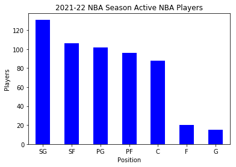

# Assignmeent 1

## Dataset 1:

- Link: [Stock Exchange Data](https://www.kaggle.com/mattiuzc/stock-exchange-data)
- Purpose : I would use this data to find the trend of stock markets over the world. The unpredictable changes in the stock market are known to everyone. Every day there are tens of thousands of listed stocks in various countries. How to master the laws in the stock market is pursued by many people.

## Dataset 2:

- Link: [2021-22 NBA Season Active NBA Players](https://www.kaggle.com/buyuknacar/202122-nba-season-active-nba-players)
- Purpose : Understand the salary structure by analying the basic information of the  players. More and more teams are begining to use data analysis to determine tactics or players. We can use historical data to analyze how much salary can be given to different positions and different physical qualities. This is very important for the management of the team.

## Dataset 3:

- Link: [Online Shoppers Purchasing Intention Dataset](https://www.kaggle.com/imakash3011/online-shoppers-purchasing-intention-dataset)
- Purpose : I would use this data to know the behavior of online shopper. Under the epidemic Online shopping has grown several times and replace the phtsical shopping. If we can understand the relationship between shoppers' behavior and consumption when shopping online, it may increase profits of e-commerce companies.

## Dataset 4:

- Link: [Covid-19 Vaccine Tweets with Sentiment Annotation](https://www.kaggle.com/datasciencetool/covid19-vaccine-tweets-with-sentiment-annotation)
- Purpose : I would use data to know the feeling of vaccine for most people. A common media framing often uses the social medi. While understanding the public's thinking, we can also check whether someone maliciously spreads rumors. 

## Dataset 5:

- Link: [Customer Personality Analysis](https://www.kaggle.com/imakash3011/customer-personality-analysis)
- Purpose : I would use data to find the target customers. It helps a business to better understand its customers and makes it easier for them to modify products according to the specific needs, behaviors and concerns of different types of customers.

# Dataset information


## Chosen dataset: ***dataset2 - 2021-22 NBA Season Active NBA Players***


```python
import pandas as pd
import matplotlib.pyplot as plt
```


```python
df = pd.read_csv("C:/Users/alan8/Downloads/archive/active_players_2.csv")
```


```python
df.info()
```

    <class 'pandas.core.frame.DataFrame'>
    RangeIndex: 558 entries, 0 to 557
    Data columns (total 9 columns):
    Name        558 non-null object
    Team        558 non-null object
    Position    558 non-null object
    Age         558 non-null int64
    Height      558 non-null object
    Height_i    558 non-null float64
    Weight      558 non-null int64
    College     485 non-null object
    Salary      445 non-null float64
    dtypes: float64(2), int64(2), object(5)
    memory usage: 39.3+ KB
    


```python
df.head()
```


<div>
<style scoped>
    .dataframe tbody tr th:only-of-type {
        vertical-align: middle;
    }

    .dataframe tbody tr th {
        vertical-align: top;
    }

    .dataframe thead th {
        text-align: right;
    }
</style>
<table border="1" class="dataframe">
  <thead>
    <tr style="text-align: right;">
      <th></th>
      <th>Name</th>
      <th>Team</th>
      <th>Position</th>
      <th>Age</th>
      <th>Height</th>
      <th>Height_i</th>
      <th>Weight</th>
      <th>College</th>
      <th>Salary</th>
    </tr>
  </thead>
  <tbody>
    <tr>
      <th>0</th>
      <td>Juhann Begarin</td>
      <td>Boston Celtics</td>
      <td>SG</td>
      <td>19</td>
      <td>6' 5"</td>
      <td>6.50</td>
      <td>185</td>
      <td>NaN</td>
      <td>NaN</td>
    </tr>
    <tr>
      <th>1</th>
      <td>Jaylen Brown</td>
      <td>Boston Celtics</td>
      <td>SG</td>
      <td>24</td>
      <td>6' 6"</td>
      <td>6.60</td>
      <td>223</td>
      <td>California</td>
      <td>26758928.0</td>
    </tr>
    <tr>
      <th>2</th>
      <td>Kris Dunn</td>
      <td>Boston Celtics</td>
      <td>PG</td>
      <td>27</td>
      <td>6' 3"</td>
      <td>6.30</td>
      <td>205</td>
      <td>Providence</td>
      <td>5005350.0</td>
    </tr>
    <tr>
      <th>3</th>
      <td>Carsen Edwards</td>
      <td>Boston Celtics</td>
      <td>PG</td>
      <td>23</td>
      <td>5' 11"</td>
      <td>5.11</td>
      <td>200</td>
      <td>Purdue</td>
      <td>1782621.0</td>
    </tr>
    <tr>
      <th>4</th>
      <td>Tacko Fall</td>
      <td>Boston Celtics</td>
      <td>C</td>
      <td>25</td>
      <td>7' 5"</td>
      <td>7.50</td>
      <td>311</td>
      <td>UCF</td>
      <td>NaN</td>
    </tr>
  </tbody>
</table>
</div>


```python
ponum = df['Position'].value_counts()
plt.title("2021-22 NBA Season Active NBA Players")
plt.xlabel("Position")
plt.ylabel("Players")
ponum.plot(kind='bar',color='blue')
plt.xticks(rotation=0)
```


    (array([0, 1, 2, 3, 4, 5, 6]), <a list of 7 Text xticklabel objects>)





```python
df.describe()
```


<div>
<style scoped>
    .dataframe tbody tr th:only-of-type {
        vertical-align: middle;
    }

    .dataframe tbody tr th {
        vertical-align: top;
    }

    .dataframe thead th {
        text-align: right;
    }
</style>
<table border="1" class="dataframe">
  <thead>
    <tr style="text-align: right;">
      <th></th>
      <th>Age</th>
      <th>Height_i</th>
      <th>Weight</th>
      <th>Salary</th>
    </tr>
  </thead>
  <tbody>
    <tr>
      <th>count</th>
      <td>558.000000</td>
      <td>558.000000</td>
      <td>558.000000</td>
      <td>4.450000e+02</td>
    </tr>
    <tr>
      <th>mean</th>
      <td>25.543011</td>
      <td>6.492151</td>
      <td>216.163082</td>
      <td>8.813696e+06</td>
    </tr>
    <tr>
      <th>std</th>
      <td>4.318651</td>
      <td>0.335012</td>
      <td>24.573787</td>
      <td>9.886777e+06</td>
    </tr>
    <tr>
      <th>min</th>
      <td>18.000000</td>
      <td>5.100000</td>
      <td>160.000000</td>
      <td>9.252580e+05</td>
    </tr>
    <tr>
      <th>25%</th>
      <td>22.000000</td>
      <td>6.200000</td>
      <td>199.250000</td>
      <td>1.802057e+06</td>
    </tr>
    <tr>
      <th>50%</th>
      <td>25.000000</td>
      <td>6.500000</td>
      <td>215.000000</td>
      <td>4.447896e+06</td>
    </tr>
    <tr>
      <th>75%</th>
      <td>28.000000</td>
      <td>6.700000</td>
      <td>233.000000</td>
      <td>1.200000e+07</td>
    </tr>
    <tr>
      <th>max</th>
      <td>41.000000</td>
      <td>7.500000</td>
      <td>311.000000</td>
      <td>4.578097e+07</td>
    </tr>
  </tbody>
</table>
</div>


